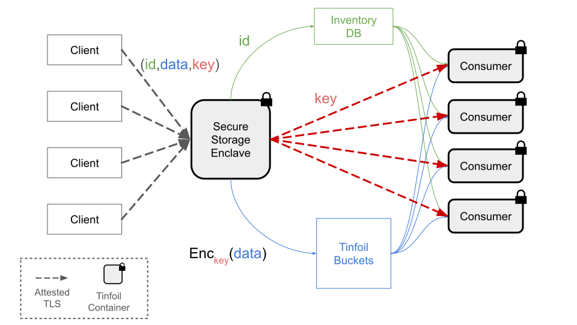

# Confidential Aggregated Storage

A blueprint for confidential secret storage with attested retrieval, designed for
MPC-style (multi-party computation) consumption scenarios.

Multiple clients update data, a client manages secret key, and some id (item ID, user ID, user-supplied metadata JSON) to a **storage enclave** over an attested TLS channel.
The storage enclave stores the id in clear to an inventory database (in order to keep track of what data has been collected) and use the key provided by the client to store the data encypted using a [Tinfoil Bucket](https://github.com/tinfoilsh/tinfoil-buckets-sidecar));
Several **consumer enclaves** attest themselves to the storage enclave, receives encryption keys over an attested TLS channel, and fetches the encrypted data from the Tinfoil Bucket for in-memory processing. Plaintext is never persisted outside the enclaves.

## Architecture

## Components

### 1. Storage Enclave (`confidential-secret-storage`)

Accepts data from clients and manages the inventory + key lifecycle.

| Endpoint | Method | Description |
|----------|--------|-------------|
| `/health` | GET | Liveness check |
| `/upload_key` | POST | Register a per-user 256-bit encryption key (base64, in-memory) |
| `/store` | POST | Encrypt data with the user's key, PUT to S3 via Tinfoil buckets sidecar, write inventory record to DB |
| `/push` | POST | Attest the consumer enclave, then deliver encryption keys over attested TLS to the consumer's `/receive` |

The storage enclave holds encryption keys **in memory only**. On restart, clients
must re-upload their keys via `/upload_key`.

### 2. Consumer Enclave (`confidential-debug-secret-consumer`)

Retrieves encrypted data from Tinfoil Bucket and processes it in-memory for MPC consumption.

| Endpoint | Method | Description |
|----------|--------|-------------|
| `/health` | GET | Liveness check |
| `/receive` | POST | Accept encryption key bundles from the storage enclave (attested) |
| `/inventory` | GET | List item IDs and metadata from the shared Postgres (no keys, no plaintext) |
| `/consume` | POST | Fetch encrypted data from S3 using in-memory keys, process in-memory, return aggregate stats |

The consumer runs a **sync loop** (every 60s) that calls the storage enclave's
`/push` with its own domain. The storage enclave attests the consumer (verifying
it runs the expected code from the expected GitHub repo) before delivering keys.

### 3. Shared Postgres (Inventory DB)

Stores **public inventory data only**: `secret_storage_items(id, user_id, metadata, created_at)`.
Both enclaves connect to the same database. The storage enclave writes; the consumer
reads. No plaintext or encryption keys are ever stored in the database.

### 4. Tinfoil Buckets Sidecar

An S3 encryption proxy running inside each enclave. Both enclaves point to the same
S3 bucket with the same tenant ID. The sidecar handles transparent encryption on PUT
and decryption on GET using the `X-Tinfoil-Encryption-Key` header.

## Flow

### Client uploads data

1. Client generates a 256-bit encryption key and calls `POST /upload_key` with
   `{"user_id": "alice", "key": "<base64-encoded 32 bytes>"}`.

2. Client calls `POST /store` with `{"user_id": "alice", "data": "<base64>", "metadata": {...}}`.
   The storage enclave:
   - Looks up the user's encryption key (in-memory)
   - Generates a random 16-byte item ID
   - PUTs the plaintext to the buckets sidecar (which encrypts it with the key)
   - Inserts `(id, user_id, metadata)` into the shared Postgres
   - Returns `{"item_id": "..."}`

### Consumer sync and consumption

3. The consumer's sync loop calls `POST /push` with `{"host": "consumer.domain"}`.

4. The storage enclave:
   - Attests the consumer using `SecureClient` (verifies the consumer runs the
     expected code from `CONSUMER_REPO` via remote attestation)
   - Collects all item IDs + their encryption keys from memory
   - Sends `[{id, key}, ...]` to the consumer's `/receive` over the attested TLS channel

5. The consumer stores the keys in memory and reads item inventory from the shared
   Postgres.

6. On `POST /consume`, the consumer:
   - Reads all item IDs + inventory data from Postgres
   - For each item, fetches the encrypted object from Tinfoil Bucket
     using the in-memory encryption key (sidecar container decrypts transparently)
   - Processes the plaintext in-memory (never persisted)
   - Returns aggregate stats (dataset count, total bytes, per-item inventory)

## Data Separation

| Data | Location | Persisted? |
|------|----------|------------|
| Encryption keys | In-memory (storage + consumer enclaves) | No (lost on restart) |
| Encrypted data (plaintext) | S3 via buckets sidecar | Yes (encrypted at rest) |
| Public inventory (id, user_id, metadata JSON) | Shared Postgres | Yes |
| Key bundles (id + key) | Attested TLS channel only | No (transient) |

## Configuration

Each enclave runs in a Tinfoil CVM with a `tinfoil-config.yml` that defines
containers, networking, and the shim. See:

- [`confidential-secret-storage`](confidential-secret-storage) - storage enclave
- [`confidential-debug-secret-consumer`](confidential-debug-secret-consumer) - consumer enclave

Both enclaves share:
- The same S3 bucket (`demo-secret-storage`) via their buckets sidecar with the same tenant
- The same Postgres database (`db-demo-storage.tinfoil.dev`)
